# Marketing_Insights_Dashboard

## About The Project
The project is about an imaginary beverage company called CodeX.

### CodeX
CodeX is a German beverage company which is recently launched in India. They launched their energy drink in 10 cities in India.

CodeX conducted a survey in those 10 cities and received results from 10k respondents.
The survey was based on consumer behaviour questions like their purchasing habits, their feedback about energy  drinks available in the market, pricing, packaging etc.
The survey question file is attached at the end of this article.

Their Marketing Team wants their Data Analyst to convert these survey results to meaningful insights which the team can use to drive actions.

The Marketing Team have asked to share certain insights. They have also asked to share meaningful recommendations from the data or external factors etc.

  
# Project

# Problem Statements & Solutions
# Demographic Insights
**Who prefers energy drinks more? (male/female/non-binary?)**

  

**b. Which age group prefers energy drinks more?**

From the result of this survey, we get to know that energy drinks are more popular among youngsters. More than 50% of the respondents belong to the Age Group 19-30.

If we look at overall young age groups from 15 to 30, then the % will rise to 70%. 

  

**c. Which type of marketing reaches the most Youth (15-30)?**

Online Ads are the most effective channel that reached 3373 respondents Age group 15-30.

 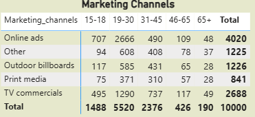

# Consumer Preference
**a. What are the preferred ingredients of energy drinks among respondents?**

As we know caffeine increases attention and alertness, and it is often used in energy drinks. Caffeine is the most expected ingredient followed by the Vitamins in energy drinks.

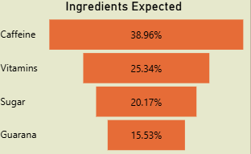

**b. What packaging preferences do respondents have for energy drinks?**

Compact & Portable Cans are high in demand followed by Innovative Bottle Designs.

 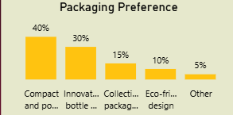

# Competition Analysis
**a. Who are the current market leaders?**

Cola Coka is leading the market followed by Bepsi. The data shows there more respondents for Cola Coka than the other brands.

 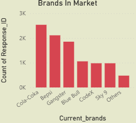

**b. What are the primary reasons consumers prefer those brands over ours?**

The top reason for choosing the brands by consumers is brand reputation.

 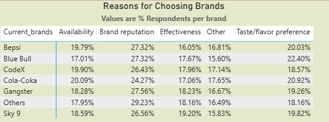

 # Marketing Channels and Brand Awareness
**a. Which marketing channel can be used to reach more customers?**
**b. How effective are different marketing strategies and channels in reaching our
customers?**

As we have seen previously Online Ads are the most effective way to reach maximum audiences in a short duration & it is cost effective as well.

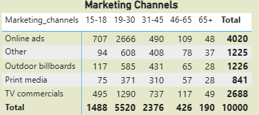

# Brand Penetration
**a. What do people think about our brand? (overall rating)**

Out of 980, 455 people have heard about our brand and hence we consider their ratings for the CodeX product’s taste.
This rating of 3.3 is the industry avg rating as well.

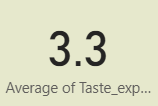

**b. Which cities do we need to focus more on?**

This Data shows people’s perception of CodeX as a brand in different cities.

The neutral and negative responses are combined in this visual as they both are great in numbers than the positive responses. Hence improving the Positive response is one area where the marketing should focus on.

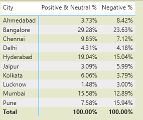

# Purchase Behavior

**a. Where do respondents prefer to purchase energy drinks?**

Supermarkets are the most common choice among consumers to buy energy drinks.

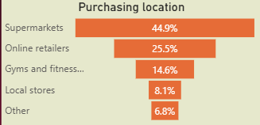

**b. What are the typical consumption situations for energy drinks among respondents?**

Sports/exercise
Studying/working late
Also, this data shows youth is consuming these drinks more.

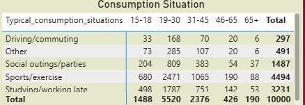

**c. What factors influence respondents’ purchase decisions, such as price range and limited edition packaging?**

43% of the consumers buy a product if the price is between 50-99.

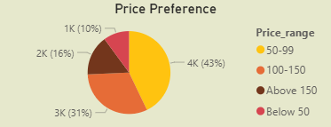

40% of the consumers do not expect a change in the packaging while 39% of consumers are open to trying the Limited Edition Packaging.

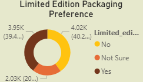

# Product Development

**a. Which area of business should we focus more on our product development?
(Branding/taste/availability)**

The taste experience rating is the same as the industry rating. This is not something that needs immediate attention.

We need to work on the availability of the product. About 20% of the consumers choose the product because it is available. Availability is a major factor in sales of a product.

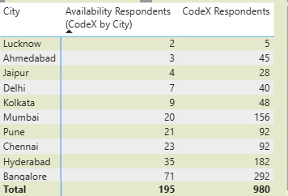

# Recommendations For CodeX

**a. What immediate improvements can we bring to the product?**

**b. What should be the ideal price of our product?**

**c. What kind of marketing campaigns, offers, and discounts we can run?**

**d. Who can be a brand ambassador, and why?**

**e. Who should be our target audience, and why?**

## What immediate improvements can we bring to the product?

* Availability
* Health Concern – If possible another survey related to health concern questions. (455 Respondents who have heard about us)
* Limited Edition Packaging
* Add more natural ingredients, reduce sugar content and add more flavours.
* Improve positive response rate.

  

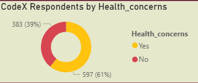

# What should be the ideal price of our product?
The price range expected by consumers lies between 50 to 150.

In cities like Ahmedabad, Chennai, Hyderabad, Kolkata, Lucknow, Mumbai, and Pune consumers expect the price range to be between 50 to 99.

While in the rest of the cities, people are willing to pay up to 150.

## What kind of offers and discounts we can run?
In the previous recommendation, we saw that we can experiment with the price in different cities. Also, if changing the price does not go with the brand’s strategy, we can provide offers on buying the pack of 6 cans at a cheaper cost.

Also, each of these cities celebrates multiple festivals throughout the year. We can come up with the gift set packs.

## What kind of marketing campaigns we can run?

* Social Media
* Influencer Marketing
* Online Retailers/E-commerce
* Guerilla Marketing

  
### Social Media

  We have seen in the insights that our consumers fall in the age group of 15 to 30. This age group is very much active on social media. Also, they get to know      about the products from online ads. Running Social Media Ads can be a good strategy to reach them.

###  Influencer Marketing

 * Cheap –
   Influencer marketing can be very cheap we set a strategy to target influencers and their audiences. We can work on a barter system or by paying some amount to the influencers.

* Collaborating with local influencers (multiple Macro & Micro) –
  We can collaborate with the influencers with the following of 10k to 100k, then 100k to 500k and so on. This will help our brand with branding and sales.

* Giveaway to Influencers and their Followers –
   Providing our products to consumers via influencers can help in changing brand perception.

* Exclusive Coupons and Discounts –
   Providing these discount coupons and exclusive offers will help us in retaining our customers. This will also play a role in remarketing by not spending money again and again on these campaigns.

### Online Retailers/E-commerce
E-commerce and online grocery store do have their own PPC platforms. We can run paid ads on these platforms to increase the sale of the product because we are still not as well known by the consumers as the other brands.

### Guerilla Marketing
* Consumers are buying products from supermarkets –
   We need to do some kind of special displays in supermarkets like renting and setting up a counter, or paying supermarkets for a space to display our products exclusively.

* Participate in Events –
  Like in Delhi The Grub Fest, Horn-oK-Please and similar food festival events. We can do some creative campaigns here to attract consumers and provide free testers to get more feedback on tasting to get reasonable insights.

### Who can be a brand ambassador, and why?

While choosing the influencers, we need to keep in mind that we have to consider certain factors in mind.
1. Budget – Celebrity influencers charge more money according to their following and impact on social media.
2. Relevancy – Energy  drinks are consumed by consumers who like to do some sort of physical activity. So, the celebrity should be a sportsperson, athlete or person indulged in some physical activity.
3. Impact – It is important to have an impact on their followers. Not every celebrity is influential but can still be followed by a vast audience. A celebrity who can influence the buying decision needs to be our brand ambassador.

I have selected 2 influencers keeping these 2 things in mind who can be our brand ambassadors.

## Virat Kohli

- Virat is a Youth Icon and famous for his discipline towards his game and fitness.
- He is widely followed on social media.
- He does a lot of endorsements.
- Partnering with him can be costly.

## Neeraj Chopra

- For the past 2 years, he has been in the news and gained popularity in social media after winning the Gold Medal for India.
- We can capitalize on the free PR that he is getting from the media.
- He is at his career peak and winning tournaments throughout the world.
- He will be playing in upcoming high-profile tournaments including the Olympics.

## Who should be our target audience, and why?
It is evident from the statistics that our consumers are mostly between the ages of 15 to 30.

From this survey, the count shows that 70% of consumers are youth.

