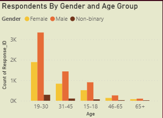

# Marketing_Insights_Dashboard

## About The Project
The project is about an imaginary beverage company called CodeX.

### CodeX
CodeX is a German beverage company which is recently launched in India. They launched their energy drink in 10 cities in India.

CodeX conducted a survey in those 10 cities and received results from 10k respondents.
The survey was based on consumer behaviour questions like their purchasing habits, their feedback about energy  drinks available in the market, pricing, packaging etc.
The survey question file is attached at the end of this article.

Their Marketing Team wants their Data Analyst to convert these survey results to meaningful insights which the team can use to drive actions.

The Marketing Team have asked to share certain insights. They have also asked to share meaningful recommendations from the data or external factors etc.

  
# Project

# Problem Statements & Solutions
# Demographic Insights
**Who prefers energy drinks more? (male/female/non-binary?)**

  

**b. Which age group prefers energy drinks more?**

  

